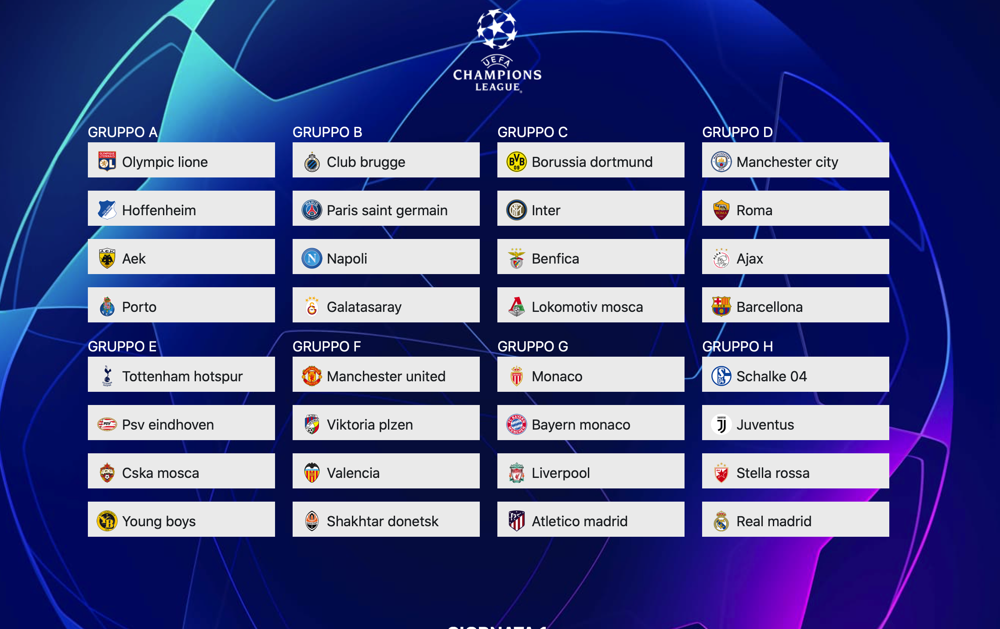
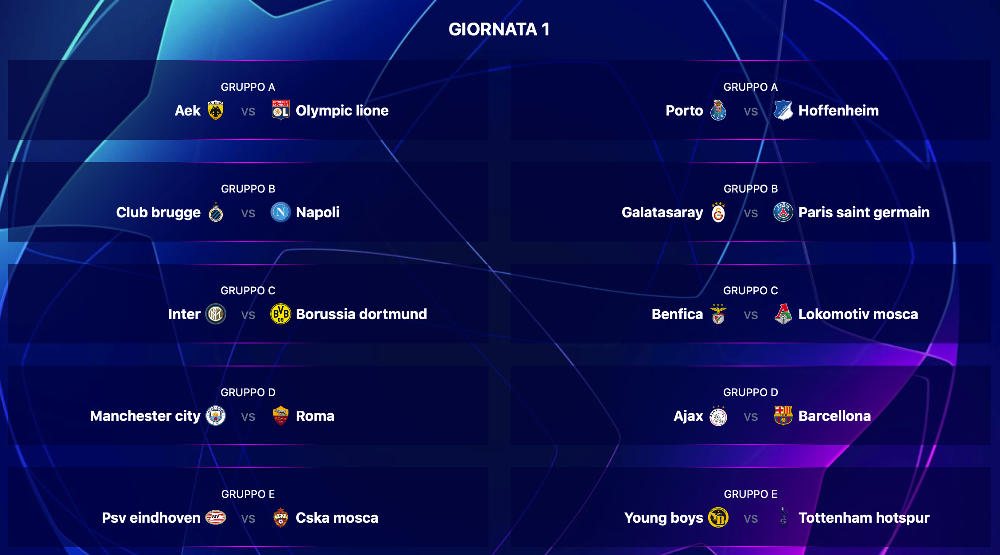

# Champions League generator

## Project
Generator of the groups and matches of the Champions League: `progetto_ialab_2.cl`

## Result
Angular project to show the result of the returned answer-set: `display-res`

URL to see the result:
[Champions](https://champions-1819.web.app)

## Report
Report of the project: `ASP.pdf`

## Run
In order to generate the answer set execute: `run.sh`

\
\

